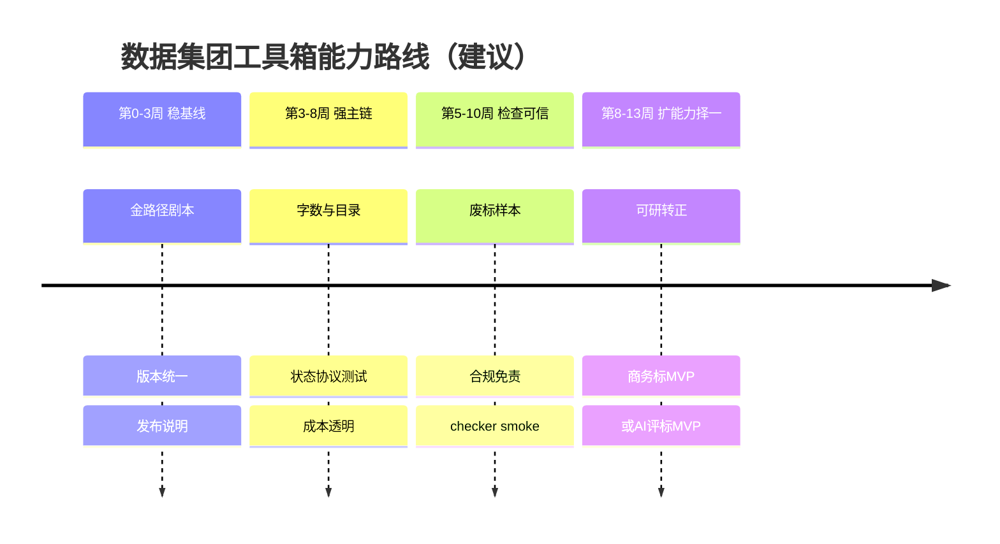

# 数据集团工具箱（数据集团工具箱）项目全景分析

> 分析基准日：2026 年（以仓库当前 HEAD 为准）
> 资料来源：`README.md`、`AGENTS.md`、`client/开发说明.md`、`client/package.json`、`analytics/README.md`、`analytics/逻辑梳理.md`、`sql/workspace_schema.sql`、`使用说明/`、`src/shared/types/navigation.ts`、`src/app/menuConfig.ts`、electron services/features 目录结构、`使用说明/更新日志/v2版本更新日志.md`
> 分析角色：项目分析师 / 系统架构师 / 交付负责人

---

## 1. 一句话目标复述

**把数据集团工具箱做成开箱即用、本地可控、成本可控的开源 AI 投标桌面工具：让用户能从招标文件解析开始，生成可编辑的技术方案/可研/商务材料，并完成查重、废标/合规检查与 Word 导出，数据尽量留在本机。**

---

## 2. 关键信息缺口与临时假设

### 2.1 当前缺失的关键信息

| 编号 | 缺失项 | 为何重要 | 影响 |
|---|---|---|---|
| G1 | 正式产品版本号与发布节奏（package.json `0.1.0` vs 更新日志 `v2.20.2`） | 影响版本治理、埋点、更新与发版计划 | 版本口径需统一 |
| G2 | 商业/可持续目标（Star、装机、赞助、企业转化？） | 决定优先级排序 | 路线图只能按「产品质量 + 社区增长」默认假设 |
| G3 | 核心团队规模与角色（维护者、贡献者、社区） | 影响 WBS 工期与并行度 | 假设 1–3 名核心维护者 + 社区 PR |
| G4 | 用户画像与使用场景占比（个人牛马 / 小企业 / 中标服务商） | 影响功能取舍 | 默认以「小团队/个人高频投标」为主 |
| G5 | 未来 90 天明确里程碑（如 v3 要做什么） | 路线图无法绑定真实承诺 | 本报告输出的是「能力优先级路线」，不是已承诺计划 |
| G6 | 预算/算力/云成本上限（Cloudflare、模型 API 成本分担） | Analytics 与 Agent 诊断有容量约束 | 按现有 Paid Plan + 本地优先假设 |
| G7 | 合规边界：是否涉及招投标法律合规意见/责任边界 | 合规检查功能的免责声明与验收标准 | 功能定位为「辅助检查」而非「法律意见」 |
| G8 | 插件生态治理规则（谁能发布、签名、下架） | 插件市场是扩展面 | 假设 GitHub Release 为发布上游，R2 为分发镜像 |

### 2.2 本报告暂时采用的假设

| 假设 ID | 内容 | 置信度 |
|---|---|---|
| A1 | 产品主体是 Electron 桌面客户端，analytics 是附属在线服务，不是主产品收入中心 | 高 |
| A2 | 核心竞争力是「本地工作区 + 低成本 AI 标书生成 + 可恢复长任务」 | 高 |
| A3 | 未完成菜单（商务标、图片知识库、AI 评标、投标机会）是 roadmap 项，不是已交付能力 | 高 |
| A4 | 开源与 AGPL 义务是硬约束：网络服务版必须开源 | 高 |
| A5 | 代码签名证书尚未接入，发布仍面临「未签名提示」 | 高 |
| A6 | 工期按「可持续维护 + 社区贡献」模型估算，不按大厂专职项目资源 | 中 |
| A7 | 成功标准优先产品质量与可用性，其次才是商业化指标 | 中 |

---

## 3. 项目全景

### 3.1 目标层

| 层级 | 内容 |
|---|---|
| 业务愿景 | 做投标领域的「OpenClaw」：优质、免费/低成本、可二次开发的 AI 标书工具 |
| 产品目标 | 从招标文件到可导出标书的完整本地闭环；检查类能力补齐废标/合规/查重；知识库提升内容贴合度 |
| 工程目标 | 架构可维护（模块图硬门禁、任务可恢复、SQLite 权威状态）、发布可重复（CI tag 发版）、统计可观测但不越界 |
| 社区目标 | 开源透明、文档可上手、插件可扩展、中国大陆可下载可访问 |

### 3.2 范围

**在范围内**
- Electron 桌面客户端（`client/`）：标书生成、扩写、可研、知识库、查重、废标项、合规检查（Beta）、导出模板、插件、资源下载、设置
- Open XML 助手（`openxmlhelper/`，.NET 10）
- 废标合规检查器（Python，`compliance`）
- Cloudflare 在线服务（`analytics/`）：埋点、公告、资源、插件市场、模型信息、许可证、Agent 失败诊断
- 发布：GitHub Releases + AtomGit 加速；CI 在 `v*` tag 时构建客户端
- 用户文档（`使用说明/`）、技术文章（`文章/`）

**明确不在当前主范围 / 仅占位**
- 商务标完整编制（菜单有入口，标注开发中）
- 图片知识库（开发中）
- AI 评标（开发中）
- 投标机会/标讯（开发中）
- Windows/macOS 正式代码签名（已知约束）
- 在线多人协作编辑（架构上是本地优先，非 SaaS）

### 3.3 干系人

| 干系人 | 关注点 | 对项目的影响力 |
|---|---|---|
| 终端用户（投标专员/小企业） | 成本、可用性、导出质量、中文路径稳定 | 主用户，决定口碑 |
| 开源贡献者 | 架构清晰度、文档、门禁可跑 | 扩展产能 |
| 维护者（作者 mark 等） | 可维护性、发版稳定、社区压力 | 决策权 |
| 模型 API 提供商 / 本地模型 | 接口兼容（OpenAI-like / Ollama / LM Studio） | 依赖外部 |
| 赞助商（APIMart、JLaudeAPI 等） | 曝光与转化 | 资源补充 |
| 企业/二次开发者 | AGPL 合规、可部署、可改 | 生态扩展 |
| Cloudflare 等云服务 | 成本、配额、稳定性 | 在线服务依赖 |
| 分发渠道（GitHub/AtomGit/官网） | 中国大陆可达性 | 获取漏斗 |

### 3.4 交付物

| 交付物 | 位置 | 当前状态 |
|---|---|---|
| Windows 安装包 + ZIP | `client/release/`（CI 上传） | 已有发版流水线 |
| macOS DMG + ZIP（x64/arm64） | 同上 | 已支持，签名仍缺 |
| 源码仓库与文档 | 仓库根目录 + 使用说明 | 持续更新 |
| Analytics API + Dashboard | `analytics.agnet.top` / `static.analytics.agnet.top` | 已部署 |
| 插件市场与资源下载 | 客户端内 + Worker/R2 | 已上线逻辑 |
| 开放 API / 插件系统 | 客户端能力 | README 标记已完成 |
| 技术方案工作区数据 | `userData/workspace/yibiao.sqlite` 等 | 运行时权威 |

### 3.5 约束

| 类型 | 约束 |
|---|---|
| 时间 | 无公开里程碑表；发版跟随 tag；更新日志显示高频小步迭代（v2.19–v2.20） |
| 人力 | 假设小核心团队 + 社区；无统一 lint，依赖 647+ 测试与 module-graph 门禁 |
| 技术 | Electron Main/preload= CJS；Renderer= ESM TS；`shared` 不得引用 `features`；耗时任务在 Main 后台；SQLite migration 为运行时权威 |
| 工具链 | Node 22（CI）；.NET 10（OpenXmlHelper）；Python 3.10+（合规检查器）；Electron native（better-sqlite3） |
| 数据与隐私 | 本地优先；埋点禁止上传 Key/Prompt/响应/路径；Agent 失败诊断独立脱敏链路，2 GiB 上限 |
| 合规 | AGPL-3.0；网络服务版须开源并保留 NOTICE |
| 发布 | 未接入 OS 代码签名；本地 Windows 无管理员权限无法完整 winCodeSign 解压 |
| 云 | Cloudflare Workers Paid Plan；6 个 Cron；密钥不进仓库 |

### 3.6 成功标准（建议采用）

| 维度 | 指标 | 说明 |
|---|---|---|
| 可用性 | 核心路径（导入招标→解析→目录→正文→导出 Word）可完成率 | 产品质量主指标 |
| 稳定性 | 长任务可恢复：页面卸载/重启后状态可回放；组内互斥正确 | 架构承诺 |
| 成本 | 用户自备 API 时单份标书 Token 成本可控（README 示例约 1 元级） | 差异化卖点 |
| 工程健康 | `npm test` + `verify:module-graph` + `npm run build` 绿；smoke 按改动范围执行 | 质量门禁 |
| 可观测 | 埋点成功写入且不泄密；Agent 失败率/重试率可查询 | 在线服务价值 |
| 生态 | 插件可安装升级；文档可自助配置模型 | 扩展性 |
| 社区 | Star/Issue 响应/文档更新 | 开源健康（非主交付但相关） |

---

## 4. MECE 一级模块拆解（6 个）

> 划分原则：按「用户价值链 + 系统运行时边界」切，互不重叠，合起来覆盖交付。

| 模块 | 名称 | 一句话职责 |
|---|---|---|
| M1 | 标书生成主流程 | 从招标/原方案到目录、全局事实、正文、图文与 Word 的生成闭环 |
| M2 | 质量与合规检查 | 查重、废标项、合规（规则/算术/资质）、（规划中）AI 评标 |
| M3 | 知识与素材资产 | 文档知识库、图片知识库、资源下载、模板库 |
| M4 | 平台底座（客户端运行时） | Electron 壳、IPC、SQLite、任务系统、文件解析、导出、日志、更新 |
| M5 | AI / Agent 引擎 | 模型配置与队列、Pi/OpenCode 运行时、Prompt、结构化输出、生图 |
| M6 | 在线服务与分发 | Analytics、公告、插件市场、资源、许可证、Agent 诊断、发布与官网分发 |

### 4.1 M1 标书生成主流程 — 二级模块

| 二级 | 说明 |
|---|---|
| M1.1 招标文件导入与解析 | 本地/MinerU 解析；多招标文件合并；标段/多阶段；18 解析项；原件与工作副本 |
| M1.2 标书分析与响应 | 关键项/自定义解析项；分析结果工作区 |
| M1.3 目录生成与编辑 | 一级目录确认 → 完整目录；开发者模式下可并行投标模版提取（`w:sdt`）；字数控制与目录二审 |
| M1.4 全局事实设定 | 企业/项目事实；补全模式 fabricate/omit/placeholder；编辑会使正文状态失效 |
| M1.5 正文生成与编辑 | 按目录节点生成；节级状态/错误；一致性检查与修复；表格清理；字数扩写压缩 |
| M1.6 图文与图表 | AI 生图、Mermaid 本地渲染、HTML 绘图、全文图片计划 |
| M1.7 已有方案扩写 | 与技术方案共用 Home/Step/Store，仅 `workflowKind` 区分 |
| M1.8 可行性研究报告 | Beta；独立 outline 任务链 |
| M1.9 商务标 | 菜单占位，开发中 |
| M1.10 Word 导出与格式模板 | 导出格式设置、我的模板/新建模板；Main 本地转图与进度事件 |

### 4.2 M2 质量与合规检查 — 二级模块

| 二级 | 说明 |
|---|---|
| M2.1 标书查重 | 多份标书相似度/重复表达 |
| M2.2 废标项检查 | 硬性条款与响应完整性；多投标文件；导出检查结果 |
| M2.3 合规检查 | Beta；报价算术、资质、保证金等；Python checker + 源码随包 |
| M2.4 AI 评标 | 占位开发中 |
| M2.5 错别字/逻辑谬误/语义化修改 | README 已列能力，落在生成后处理与检查链路 |

### 4.3 M3 知识与素材 — 二级模块

| 二级 | 说明 |
|---|---|
| M3.1 文档知识库 | 导入、preparation/matching、超长文档分段、全局检索（分页，同步子串扫描） |
| M3.2 图片知识库 | 占位开发中 |
| M3.3 资源下载 | 客户端资源页 + Worker 点击统计 |
| M3.4 导出模板库 | SQLite `template` 相关 migration（v15）；预设模版 |
| M3.5 投标模版提取（生成链路附属） | 开发者模式 Agent 写 `bid-template.docx` + fields.json |

### 4.4 M4 平台底座 — 二级模块

| 二级 | 说明 |
|---|---|
| M4.1 应用壳与路由 | `AppShell`/`Sidebar`/`AppRouter`/`menuConfig`/`SectionId`；新增页面五处同步 |
| M4.2 IPC 与 preload | 薄注册；`window.yibiao`；workspaceDatabaseChannels 生命周期 |
| M4.3 SQLite 工作区 | `yibiao.sqlite`；migration 权威；schema 文件同步；WAL |
| M4.4 任务系统 | `taskService`：组内互斥、checkpoint、恢复策略、beforeCommit |
| M4.5 文件解析与资源路径 | `fileService`/`parseDocumentWithConfig`；yibiao-asset://；UTF-8 中文路径 |
| M4.6 导出管线 | `exportService`、OpenXmlHelper、localImageRenderService |
| M4.7 日志与性能 | developer logs、silentFileLog、perfTrace |
| M4.8 打包与工具 vendor | agent-tools / openxml-tools / compliance-checker extraResources |
| M4.9 模块图与测试门禁 | verify:module-graph、npm test、smoke:* |

### 4.5 M5 AI / Agent 引擎 — 二级模块

| 二级 | 说明 |
|---|---|
| M5.1 模型配置 | 文本模型、生图模型、解析方式、Agent 配置、组件配置 |
| M5.2 aiService 统一队列 | 文本/生图队列、并发、重试、取消、Token、埋点 |
| M5.3 Agent 运行时 | Pi SDK（默认/可选）与 OpenCode；独立 Runtime/Session；primary_session |
| M5.4 Prompt 与结构化输出 | generation promptBuilders、json_validation_schemas、弱模型 JSON 稳定性 |
| M5.5 长文本与一致性 | 全文一致性、分阶段字数、缓存友好 Prompt 顺序（见文章系列） |
| M5.6 生图与本地渲染 | 生图 API、Mermaid/HTML 本地转图 |
| M5.7 Agent 问答与诊断 | 全局问答 Dialog；失败诊断包脱敏上传（独立链路） |

### 4.6 M6 在线服务与分发 — 二级模块

| 二级 | 说明 |
|---|---|
| M6.1 埋点采集 | `/track` → AE；IP 策略；授权快照；禁止敏感字段 |
| M6.2 统计聚合 | 6 Cron；D1 stats_*；历史 vs 今日口径；回填脚本 |
| M6.3 Dashboard | 管理端流量/模型/Agent/客户端等 |
| M6.4 公告与模型信息 | KV notice；models.dev 同步 + 人工覆盖 |
| M6.5 许可证 | ECDSA P-256 签发；客户端校验；source_trusted 统计 |
| M6.6 资源与插件市场 | R2 镜像 GitHub Release；当前版+上一版；租约锁 |
| M6.7 Agent 失败诊断服务 | 开关+精确版本；2 GiB；license 上传 |
| M6.8 发布与分发 | release.yml、AtomGit、官网 yibiao.pro、构建证明 |

---

## 5. 模块明细（目标/输入/输出/任务/依赖/风险/角色/验收）

### M1 标书生成主流程

| 项 | 内容 |
|---|---|
| 目标 | 用户可从招标文件生成可编辑、可导出的高质量技术方案/扩写方案/可研 |
| 输入 | 招标 Word/PDF 等、已有方案、知识库选择、字数/全局事实/解析项配置、AI 模型配置 |
| 输出 | SQLite 目录节点正文、解析项结果、图片资源、Word 导出、检查中间结果 |
| 关键任务 | 解析链路稳健；目录 protocol（replace/edit/delete/add/sort）正确；正文任务可恢复；字数控制；一致性修复；导出保真 |
| 依赖 | M4 任务/SQLite/解析；M5 AI/Agent；M3 知识库可选增强；OpenXmlHelper |
| 风险 | 状态机复杂（失效规则多）；长生成成本与失败；多标段/多阶段边界；模版提取仅开发者模式 |
| 角色 | 核心维护者（架构+任务）；贡献者（UI/提示词）；测试用户（标书样本） |
| 验收 | 完整金路径冒烟；`technical-plan-ui` smoke；重启恢复；导出 Word 可打开且结构正确；扩写入口与生成入口同时验证 |

### M2 质量与合规检查

| 项 | 内容 |
|---|---|
| 目标 | 降低废标与响应遗漏风险，辅助重复内容治理与算术/资质类检查 |
| 输入 | 多份标书/投标文件、招标文件、检查配置、Python checker |
| 输出 | 查重结果、废标项 finding、合规检查报告、可导出状态 |
| 关键任务 | 导入正确；finding 模型稳定；多文件场景；compliance 双端（Electron + Python）；结果导出 |
| 依赖 | M4 文件/任务/SQLite；M5 部分 AI 检查；vendor compliance-checker |
| 风险 | 规则覆盖不足被误解为「安全」；Python 环境/打包缺失；法律边界表述 |
| 角色 | 维护者；领域顾问（标书专家）；贡献者 |
| 验收 | `rejection-ui` / `compliance-ui` smoke；`smoke:compliance-checker`；样本集回归；文档明确「辅助非法律意见」 |

### M3 知识与素材资产

| 项 | 内容 |
|---|---|
| 目标 | 沉淀企业资料与历史案例，生成时可被选用，降低空洞感 |
| 输入 | 用户文档/图片、资源元数据、插件包、导出模板 |
| 输出 | 知识库条目与检索结果、生成引用素材、可安装插件、资源下载 |
| 关键任务 | 导入与解析缓存；超长文档分段匹配；检索分页正确；插件安装/升级；模板 CRUD |
| 依赖 | M4 Store/解析；M5 生成时知识解析（knowledgeResolution）；M6 插件/资源 API |
| 风险 | 检索仍是同步子串扫描，大数据量性能；图片库未就绪；插件安全与兼容 |
| 角色 | 维护者；用户反馈素材样本；插件作者 |
| 验收 | `knowledge-base-ui` smoke；检索分页/失败保留页；插件安装升级回滚到上一版地址可用 |

### M4 平台底座

| 项 | 内容 |
|---|---|
| 目标 | 提供可恢复、可维护、可验证的本地桌面运行时 |
| 输入 | 用户操作、迁移脚本、native 模块、vendor 工具 |
| 输出 | 稳定 IPC、SQLite 状态、任务事件、解析/导出能力、日志、安装包 |
| 关键任务 | migration 与 schema 同步；任务 checkpoint/恢复；IPC 薄层纪律；模块图方向；打包产物干净 |
| 依赖 | Electron/Node22/.NET10/Python；CI |
| 风险 | better-sqlite3 ABI；测试目录漏扩展成孤儿测试；`dist` 残留打进 asar；无 lint |
| 角色 | 维护者（必守）；所有 PR 贡献者 |
| 验收 | 默认门禁全绿；改动范围 smoke；`smoke:ipc-boot`/`schema`/`electron-native` 按需；打包体积合理 |

### M5 AI / Agent 引擎

| 项 | 内容 |
|---|---|
| 目标 | 在多模型/弱模型/本地模型条件下稳定完成长标书任务，且成本可统计 |
| 输入 | 用户 API 配置、任务队列、Prompt、Schema、知识上下文 |
| 输出 | 目录/正文/解析 JSON/图片/Agent 工具结果、Token 统计、失败诊断 |
| 关键任务 | 队列与取消传播；结构化 JSON 稳定；Prompt 缓存友好；Pi/OpenCode 切换与隔离；自检 |
| 依赖 | 外部模型 API；vendor agent-tools；M4 任务作用域 |
| 风险 | 弱模型输出不稳；长上下文成本；Agent 失败定位难；运行时切换后的在途任务 |
| 角色 | 维护者；AI 工程向贡献者；用户配置的模型服务商 |
| 验收 | Agent 成功率/重试率可观测；JSON 校验 schema 生效；开发者测试页；中断任务状态符合恢复策略 |

### M6 在线服务与分发

| 项 | 内容 |
|---|---|
| 目标 | 提供可观测性、公告、资源/插件分发、授权与失败诊断，且不破坏开源与隐私承诺 |
| 输入 | 客户端埋点/上传、GitHub Release、models.dev、管理端操作 |
| 输出 | Dashboard 数据、公告、模型信息、插件包、license、诊断包 |
| 关键任务 | 埋点口径一致；Cron 幂等；插件同步与清理；IP 封禁事务；密钥不入库 |
| 依赖 | Cloudflare 账户与 Secret；GitHub token；客户端版本 |
| 风险 | 口径错误导致决策失真；误删 resources DB；诊断包容量；客户端被封禁误伤 |
| 角色 | 运营/维护者（Dashboard）；发布负责人；安全负责人 |
| 验收 | `/health` 正常；track 抽样成功；Dashboard 关键页有数；插件下载地址为 R2；部署目录变更自动部署生效 |

---

## 6. 依赖关系、数据流与关键路径

### 6.1 文字版依赖关系

```text
用户模型配置 (M5.1)
        │
        ▼
aiService / Agent Runtime (M5.2/M5.3)
        ▲
        │ 作用域 queueScopeId / cancel
        │
taskService + SQLite Stores (M4.3/M4.4)
        ▲
        │ checkpoint / event
        │
Renderer Features: 技术方案 / 扩写 / 可研 / 检查 (M1/M2)
        │                 │
        │                 ├── 可选知识库匹配 (M3)
        │                 └── 结果导出 Word (M1.10 ← OpenXmlHelper)
        │
window.yibiao IPC (M4.2)
        │
electron services + 文件解析/资源 (M4.5)
        │
        └── 埋点/公告/插件/诊断 (M6，失败静默，不阻塞主流程)
```

### 6.2 关键数据流（技术方案金路径）

```text
招标文件(.doc/.docx/.wps/.pdf…)
    → fileService 解析配置（本地或 MinerU）
    → tender-original.md + tender-files/ + tender-originals/
    → （选标段）重建工作副本 tender.md，清空下游
    → bidAnalysis 任务 → SQLite 分析项
    → outline 任务（可选开发者模式并行 template 提取）
    → technical_plan_outline_nodes（正文权威）
    → global facts / knowledge resolve
    → contentGeneration stages
         （plan → sectionGeneration → illustration → consistency
          → wordAdjustment → tableCleanup → …）
    → outline word control 快照约束字数
    → exportService + OpenXmlHelper + 本地 mermaid/HTML 转图
    → .docx
    → 副作用：ai_request/agent_runtime 埋点 → Analytics (M6)
```

### 6.3 关键路径（Critical Path）

生成一条可用标书的最短强依赖链：

1. **环境就绪**：模型 API/本地模型可配置 + Workspace DB 迁移完成（Gate 放行）
2. **招标导入解析**：无解析则无分析
3. **标段/范围确定**：多标段错误选择会导致下游全清
4. **分析项任务成功**
5. **目录生成成功**（含用户确认一级目录；字数控制在此阶段介入）
6. **全局事实确定**（编辑事实会清空正文状态 → 必须在正文前稳定）
7. **正文分节生成**（最长耗时/最高成本段）
8. **一致性与字数调整阶段**
9. **Word 导出**（含图片落地）

任一环节失败或状态失效协议触发，都会延长关键路径。检查类（M2）与知识库（M3）是增强线，不阻塞首次导出，但影响投标风险与内容质量。

### 6.4 系统上下文图（SVG）

```svg
<svg xmlns="http://www.w3.org/2000/svg" viewBox="0 0 680 520" width="680" height="520">
  <style>
    text { font-family: -apple-system, 'PingFang SC', 'Microsoft YaHei', sans-serif; }
    .title { font-size: 14px; font-weight: 500; fill: #1f2937; }
    .body { font-size: 13px; font-weight: 400; fill: #111827; }
    .cap { font-size: 11px; fill: #6b7280; }
    .box { fill: #ffffff; stroke: #d1d5db; stroke-width: 0.5; rx: 8; }
    .core { fill: #eef2ff; stroke: #6366f1; }
    .ext { fill: #f9fafb; }
  </style>
  <defs>
    <marker id="ar" markerWidth="8" markerHeight="8" refX="6" refY="3" orient="auto">
      <path d="M0,0 L6,3 L0,6" fill="none" stroke="#6b7280" stroke-width="1"/>
    </marker>
  </defs>
  <text x="340" y="28" text-anchor="middle" class="title">数据集团工具箱 系统上下文</text>

  <rect x="40" y="50" width="160" height="44" class="box ext"/>
  <text x="120" y="72" text-anchor="middle" class="body">投标用户</text>
  <text x="120" y="88" text-anchor="middle" class="cap">招标文件 / 原方案 / 知识</text>

  <rect x="260" y="50" width="160" height="44" class="box ext"/>
  <text x="340" y="72" text-anchor="middle" class="body">模型 API / 本地模型</text>
  <text x="340" y="88" text-anchor="middle" class="cap">OpenAI-like / Ollama</text>

  <rect x="480" y="50" width="160" height="44" class="box ext"/>
  <text x="560" y="72" text-anchor="middle" class="body">Cloudflare 在线服务</text>
  <text x="560" y="88" text-anchor="middle" class="cap">公告/资源/统计/诊断</text>

  <rect x="150" y="180" width="380" height="72" class="box core"/>
  <text x="340" y="210" text-anchor="middle" class="body">数据集团工具箱桌面客户端 client/</text>
  <text x="340" y="230" text-anchor="middle" class="cap">Electron Main + React Renderer + SQLite 工作区</text>

  <rect x="40" y="300" width="140" height="56" class="box"/>
  <text x="110" y="322" text-anchor="middle" class="body">文档解析</text>
  <text x="110" y="340" text-anchor="middle" class="cap">本地 / MinerU</text>

  <rect x="200" y="300" width="140" height="56" class="box"/>
  <text x="270" y="322" text-anchor="middle" class="body">AI/Agent 引擎</text>
  <text x="270" y="340" text-anchor="middle" class="cap">aiService / Pi</text>

  <rect x="360" y="300" width="140" height="56" class="box"/>
  <text x="430" y="322" text-anchor="middle" class="body">生成与检查任务</text>
  <text x="430" y="340" text-anchor="middle" class="cap">taskService</text>

  <rect x="520" y="300" width="120" height="56" class="box"/>
  <text x="580" y="322" text-anchor="middle" class="body">Word 导出</text>
  <text x="580" y="340" text-anchor="middle" class="cap">OpenXmlHelper</text>

  <rect x="200" y="400" width="280" height="48" class="box ext"/>
  <text x="340" y="420" text-anchor="middle" class="body">本地工作区 userData/</text>
  <text x="340" y="436" text-anchor="middle" class="cap">yibiao.sqlite · markdown · images · logs</text>

  <line x1="120" y1="94" x2="200" y2="180" stroke="#6b7280" stroke-width="1" marker-end="url(#ar)"/>
  <line x1="340" y1="94" x2="340" y2="180" stroke="#6b7280" stroke-width="1" marker-end="url(#ar)"/>
  <line x1="560" y1="94" x2="480" y2="180" stroke="#6b7280" stroke-width="1" marker-end="url(#ar)"/>
  <line x1="250" y1="252" x2="130" y2="300" stroke="#6b7280" stroke-width="1" marker-end="url(#ar)"/>
  <line x1="320" y1="252" x2="290" y2="300" stroke="#6b7280" stroke-width="1" marker-end="url(#ar)"/>
  <line x1="380" y1="252" x2="410" y2="300" stroke="#6b7280" stroke-width="1" marker-end="url(#ar)"/>
  <line x1="450" y1="252" x2="560" y2="300" stroke="#6b7280" stroke-width="1" marker-end="url(#ar)"/>
  <line x1="340" y1="356" x2="340" y2="400" stroke="#6b7280" stroke-width="1" marker-end="url(#ar)"/>
</svg>
```

### 6.5 代码架构分层（文字）

```text
┌──────────────────────────────────────────────────────────┐
│ Renderer (src/)  React 19 + Vite + 全局 CSS + Radix      │
│  app/ router · components/ shell · features/* 业务 UI    │
│  shared/{ui,types,prompts,utils,markdown,analytics}      │
│  仅经 window.yibiao 访问本机能力；不存业务权威状态         │
└───────────────────────────┬──────────────────────────────┘
                            │ preload.cjs + ipc/*.cjs
┌───────────────────────────▼──────────────────────────────┐
│ Main (electron/)  CJS                                     │
│  main.cjs 生命周期 · ipc 装配 · services/* 业务          │
│  stores + sqliteDatabase migration（状态权威）            │
│  tasks/* 长任务 · ai/ agent/ pi/ export/ knowledge/ ...   │
│  utils paths/log/queue/textEdit/perfTrace                 │
└───────┬───────────────────────┬──────────────────────────┘
        │                       │
        ▼                       ▼
 userData 本地数据        extraResources 外部助手
 sqlite / md / images     openxmlhelper(.NET) · compliance(Py) · agent-tools
```

**模块方向硬约束**：`shared` ↛ `features`；Main 业务 Prompt 与任务同侧；`agent/`/`pi/` 不引用业务 Store。

---

## 7. WBS / 风险 / 优先级 / 路线图

### 7.1 WBS 表（工作分解）

> 编号规则：Mx.y.z。工期为相对估算人日（E），假设核心维护者 0.5–2 人可用。

| WBS | 工作包 | 交付物 | 依赖 | 优先级 | E | 置信度 |
|---|---|---|---|---|---|---|
| **1.0 平台质量与可维护性** | | | | P0 | | |
| 1.1.1 | 版本号治理统一（客户端 package vs 产品版本/更新日志） | 单一版本源 | — | P0 | 1 | 中 |
| 1.1.2 | 默认门禁固化到 PR 清单/贡献文档 | CONTRIBUTING 检查表 | — | P0 | 1 | 高 |
| 1.1.3 | 测试 glob 与目录同步机制说明/脚本防呆 | 防孤儿测试 | 1.1.2 | P1 | 2 | 中 |
| 1.1.4 | 关键路径回归样本库（招标样本+期望目录片段） | `tests/samples` 约定 | — | P0 | 3 | 低 |
| **2.0 标书生成主路径强化** | | | | P0 | | |
| 2.1.1 | 金路径端到端手工剧本（导入→导出） | 可重复验收脚本/清单 | 1.1.4 | P0 | 2 | 高 |
| 2.1.2 | 字数控制与目录二审稳定性（v2.20 方向延续） | 任务指标 + 修复 | — | P0 | 5 | 中 |
| 2.1.3 | 状态失效协议回归（saveOutline reason 矩阵） | 自动化用例 | 2.1.1 | P0 | 3 | 中 |
| 2.1.4 | 可研报告 Beta → 正式能力评估 | 能力清单/退出 Beta 条件 | 2.1.1 | P1 | 5 | 低 |
| 2.1.5 | 商务标最小闭环（MVP） | 占位转可用流程 | 2.1.1 | P2 | 10+ | 低 |
| **3.0 检查与合规可信度** | | | | P1 | | |
| 3.1.1 | 废标项检查样本集与召回说明 | 文档+测试 | — | P1 | 3 | 中 |
| 3.1.2 | 合规检查规则清单与免责声明 | UI 文案+文档 | 3.1.1 | P1 | 2 | 高 |
| 3.1.3 | compliance checker 打包与 smoke 常态化 | CI/本地脚本 | — | P1 | 2 | 高 |
| 3.1.4 | AI 评标 MVP 定义（若做） | 需求说明 | 2.1.1,3.1.2 | P2 | 8+ | 低 |
| **4.0 知识库与素材** | | | | P1 | | |
| 4.1.1 | 知识库导入/匹配耗时与失败提示优化 | UX+日志 | — | P1 | 3 | 中 |
| 4.1.2 | 检索性能边界评估（何时需要索引） | 基准报告 | 4.1.1 | P2 | 3 | 中 |
| 4.1.3 | 图片知识库 MVP | 可存储/可选图 | — | P2 | 8+ | 低 |
| **5.0 AI/Agent 稳定性与成本** | | | | P0/P1 | | |
| 5.1.1 | Agent 成功率监控看板使用规范 | 运营看板说明 | M6 已有接口 | P1 | 1 | 高 |
| 5.1.2 | 弱模型 JSON 失败模式案例库 | 案例+prompt 对策 | — | P1 | 3 | 中 |
| 5.1.3 | Pi/OpenCode 切换时在途任务契约测试 | 测试 | — | P1 | 2 | 中 |
| 5.1.4 | 成本报表（按项目粗算 token） | 本地/统计口径 | 5.1.1 | P2 | 5 | 低 |
| **6.0 发布、签名与分发** | | | | P1 | | |
| 6.1.1 | 未签名安装体验说明（官网/更新日志） | 用户可见说明 | — | P1 | 1 | 高 |
| 6.1.2 | 代码签名证书与公证接入评估 | 评估报告/预算 | 6.1.1 | P1 | 3 | 中 |
| 6.1.3 | 本地打包 SOP 固化（dist 残留、.NET10） | 文档已存在→演练 | — | P1 | 1 | 高 |
| 6.1.4 | 中国大陆下载链路健康检查 | 监测 | — | P2 | 2 | 中 |
| **7.0 在线服务与生态** | | | | P1/P2 | | |
| 7.1.1 | 埋点口径变更评审清单 | 变更 checklist | — | P1 | 1 | 高 |
| 7.1.2 | 插件发布/同步演练（含上一版保护） | 演练记录 | — | P1 | 2 | 中 |
| 7.1.3 | Agent 诊断容量与版本策略回顾 | 策略文档 | — | P2 | 2 | 中 |
| 7.1.4 | 资源库/公告运营节奏 | 运营日历 | — | P2 | 2 | 低 |

### 7.2 风险登记表

| 风险 ID | 风险 | 模块 | 概率 | 影响 | 等级 | 缓解措施 | 应急计划 | 责任角色 |
|---|---|---|---|---|---|---|---|---|
| R01 | 技术方案状态机回归（失效协议）导致正文丢失/残留 | M1/M4 | 中 | 高 | **高** | reason 矩阵测试 + UI 冒烟 + handover 账目 | 回滚 migration 说明；备份 userData | 核心维护 |
| R02 | 长任务中断后恢复策略不符合用户预期 | M4/M1 | 中 | 高 | **高** | 按任务类型恢复策略单测 + 手工重启剧本 | 提供导出中间结果 | 维护者 |
| R03 | 模型输出不稳定导致目录/JSON 失败率高 | M5 | 高 | 中 | **高** | schema 校验、重试、弱模型提示词、失败诊断 | 切换推荐模型/降级模式 | AI 负责人 |
| R04 | 生成成本超出小企业预期，口碑受损 | M5/产品 | 中 | 中 | **中** | 字数控制、缓存友好 Prompt、成本示例透明 | 文档提供低成本配置指南 | 产品/维护 |
| R05 | better-sqlite3 ABI / native 环境导致用户无法启动 | M4 | 中 | 高 | **高** | postinstall、electron-native smoke、安装说明 | 远程指导重建依赖 | 维护者 |
| R06 | 打包残留或 extraResources 缺失 | M4/发布 | 中 | 高 | **高** | dist 清理检查、verify-agent-tools、CI 构建 | 热修发版 | 发布负责人 |
| R07 | 无代码签名导致用户不敢安装 | 发布 | 高 | 中 | **高** | 官网说明校验方式；规划签名 | 提供 hash 与正版渠道 | 发布/运营 |
| R08 | Analytics 口径错误误导优先级 | M6 | 低 | 中 | **中** | 逻辑梳理文档 + 变更评审 | 回填脚本修复 | 运营 |
| R09 | 插件市场分发失败或并发清理误删 | M6 | 低 | 高 | **中** | 租约锁、保留上一版、同步演练 | R2 手动恢复 | 服务维护 |
| R10 | Agent 诊断包隐私/容量风险 | M6 | 低 | 高 | **中** | 脱敏、license、2GiB、版本白名单 | 关闭接收开关 | 安全/维护 |
| R11 | AGPL 义务被二次开发忽略引发法律风险 | 合规 | 中 | 中 | **中** | LICENSE/NOTICE 醒目；官网说明 | 法律咨询预留 | 作者 |
| R12 | 合规检查被误认为法律保证 | M2/产品 | 中 | 高 | **高** | UI/文档免责；命名强调「辅助」 | 人工复核流程 | 产品 |
| R13 | 社区 PR 引入 shared→features 等违规 | M4 | 中 | 中 | **中** | verify:module-graph 硬门禁 | CI 拒绝合并 | 维护者 |
| R14 | 核心维护者单点 | 全局 | 中 | 高 | **高** | 文档（开发说明/handover）+ 架构边界 | 关键路径双人评审 | 作者/社区 |
| R15 | 外部模型/Cloudflare 变更或停服 | M5/M6 | 中 | 中 | **中** | 多模型兼容；本地模型；Worker 逻辑开源可迁 | 降级本地功能 | 架构 |
| R16 | Windows 中文路径/编码问题 | M4 | 中 | 中 | **中** | UTF-8 约定 + 中文路径测试 | 热修 | 维护者 |
| R17 | 未完成功能（商务标/评标/机会）造成预期落差 | 产品 | 高 | 中 | **高** | 菜单明确「开发中/star 加速」；路线图沟通 | 控制宣传口径 | 产品 |
| R18 | 统一 lint 缺失导致风格漂移 | 工程 | 中 | 低 | **低** | 强测试/模块图补偿；可选引入 | 渐进 prettier/eslint | 维护者 |

### 7.3 优先级矩阵（影响 × 紧急/成本）

| | 低实现成本 | 高实现成本 |
|---|---|---|
| **高价值** | **先做**：版本统一；金路径剧本；合规免责文案；发布说明；Agent 看板规范；门禁贡献清单 | **规划投入**：字数/目录稳定性；状态协议测试；代码签名接入；样本回归库；弱模型对策 |
| **低价值** | **顺手做**：官网下载健康检查；日志字段规范 | **缓做/不做**：图片知识库大而全；AI 评标完整版；本地全文检索引擎（无数据证明前） |

### 7.4 阶段路线图（建议 90 天能力路线，非已承诺）

| 阶段 | 时间窗 | 主题 | 目标结果 | 退出标准 |
|---|---|---|---|---|
| **P0 稳基线** | 第 0–3 周 | 质量与发布可信 | 金路径可重复验收；版本口径清晰；未签名用户预期管理 | 金路径 checklist 全绿；门禁在 PR 执行 |
| **P1 强主链** | 第 3–8 周 | 生成质量 | 字数控制/目录二审更稳；状态失效回归覆盖；成本透明 | 样本集通过率提升可量化；关键回归用例入库 |
| **P2 补检查可信** | 第 5–10 周 | 废标/合规 | 规则清单+免责+smoke 常态化 | compliance 检查样本说明可发布 |
| **P3 扩能力（择一）** | 第 8–13 周 | 可研正式 **或** 商务标 MVP **或** AI 评标 MVP | 一个占位能力转正，不并行摊薄 | 该能力独立冒烟+文档+更新日志 |
| **持续** | 全程 | 在线服务/插件/文档 | 口径稳定、同步演练、贡献文档 | 月度回顾指标 |



---

## 8. 不确定项与置信度清单

| 项 | 置信度 | 不确定原因 | 需要你补充的资料 |
|---|---|---|---|
| 产品目标与成功 KPI | 中 | 仓库强调开源/低成本，未见 OKR | 近 90 天目标（Star/装机/企业单/稳定性） |
| 人力与专职程度 | 低 | 仅见 author 与社区鸣谢 | 维护者名单与每周可投入 |
| 版本真源 | 中 | `0.1.0` vs `v2.20.2` | 以哪个为准、是否 monorepo 多包版本 |
| 商务标/评标/机会优先级 | 低 | 菜单仅 star 提示 | 是否排期、目标用户是否强需求 |
| 代码签名预算 | 低 | 已知未签名 | 是否采购证书/公证、目标平台 |
| 合规功能责任边界 | 低 | Beta | 是否需要法律审阅文案 |
| 用户实际失败模式 | 中 | 有 Agent 诊断能力，但本机无数据 | 近 30 天失败诊断摘要（脱敏）或 Issue 标签分布 |
| 知识库数据规模 | 中 | 检索实现简单 | 典型用户文档量级（百/千/万） |
| 发布回滚策略 | 中 | 有 CI 上传，未见详细回滚 SOP | 是否保留 N 个历史安装包强制指引 |
| analytics 管理权限与值守 | 低 | 文档有 ADMIN_TOKEN 机制 | 谁值班、告警渠道 |

---

## 9. 下一步建议（可执行）

1. **本周内对齐两件事实**：① 产品版本真源；② 90 天唯一主线（质量 / 能力转正 / 签名与分发）。没有主线就不要并行开三个 Beta。
2. **把「技术方案金路径」写成验收剧本**（导入→解析→标段→目录→事实→正文→导出），每次发版前人工走一遍；这是目前风险最高、价值最高的路径。
3. **补齐状态协议回归**：围绕 `saveOutline` 的 `replace/edit/delete/add-*/sort` 与「运行中禁止目录变更」做自动化，避免静默数据损坏。
4. **产品侧管理预期**：对开发中菜单保持诚实标签；合规检查必须带辅助性免责；未签名安装提供校验说明。
5. **工程侧不追求大重构**：已有 module-graph 与 647+ 测试是资产；优先「样本库 + smoke 覆盖」，暂缓大规模模块再切分（除非满足 AGENTS.md 量化阈值）。
6. **运营侧月度看三张表**：Agent 成功率/重试率、模型 Token 成本分布、Issue 标签趋势——用来决定下一迭代投生成质量还是检查能力。
7. **若你要正式立项管理**：请补充「干系人 RACI + 里程碑日期 + 样本标书 N 份」，可将本报告 WBS 直接升格为带负责人与日期的执行计划。

---

## 附录 A：一级模块与菜单映射

| 菜单（SectionId） | 模块 | 状态 |
|---|---|---|
| technical-plan | M1 | 已交付核心 |
| existing-plan-expansion | M1.7 | 已交付 |
| feasibility-report | M1.8 | Beta |
| business-bid | M1.9 | 开发中 |
| my-templates / new-template | M3.4 / M1.10 | 已交付 |
| document-knowledge-base | M3.1 | 已交付 |
| image-knowledge-base | M3.2 | 开发中 |
| duplicate-check | M2.1 | 已交付 |
| rejection-check | M2.2 | 已交付 |
| compliance-check | M2.3 | Beta |
| ai-evaluation | M2.4 | 开发中 |
| bid-opportunity | （机会域） | 开发中 |
| plugin-manager | M6.6 / M3 | 已交付 |
| resources | M3.3 | 已交付 |
| settings | M5.1 / M4 | 已交付 |
| developer-* | M4/M5 验证 | 开发者模式 |

## 附录 B：默认质量门禁（执行视角）

| 改动 | 命令 |
|---|---|
| 每次 | `cd client` → `npm test` → `npm run verify:module-graph` → `npm run build` |
| Renderer UI | 默认门禁 + 对应 `smoke:<feature>-ui` |
| Main/preload | `node --check` + 默认门禁；必要时 `smoke:ipc-boot` |
| Store/migration | 默认门禁 + `smoke:electron-native` / `smoke:schema` / `test:electron-abi` |
| 发版 | tag `v*` → CI Node22 → electron-builder → gh release upload |

---

*本报告基于公开仓库静态资料与项目内开发文档，不替代一次真实的需求访谈与运行数据复盘。*
